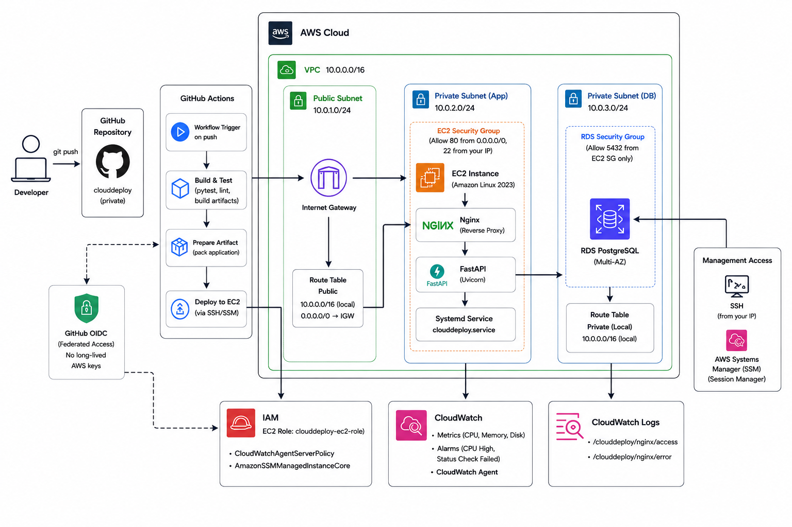

# CloudDeploy FastAPI

CloudDeploy is a small production-inspired FastAPI deployment project built to understand how an application moves from a Git repository to a running service on AWS.

The project deliberately avoids unnecessary enterprise tooling. Instead, it focuses on understanding the fundamentals end-to-end:

**networking → Linux → application deployment → database → CI/CD → observability → infrastructure as code**



---

## What this project demonstrates

* FastAPI + Uvicorn application deployment
* Amazon EC2 running Amazon Linux 2023
* Nginx as a reverse proxy
* `systemd` for application process management
* PostgreSQL on Amazon RDS
* VPC networking with public and private subnets
* Security groups controlling application/database access
* IAM roles and AWS Systems Manager
* GitHub Actions CI/CD
* GitHub Actions OIDC authentication to AWS
* CloudWatch logs, metrics, and alarms
* Alembic database migrations
* Terraform infrastructure as code
* Remote Terraform state in Amazon S3

---

## Architecture

The application runs on an EC2 instance inside a public subnet.

Nginx is the public-facing web server and forwards requests to FastAPI/Uvicorn, which listens only on the local machine.

FastAPI connects to PostgreSQL running on Amazon RDS inside private subnets.

RDS is not publicly accessible.

```text
                         Internet
                            │
                            ▼
                      Nginx :80
                            │
                            ▼
                  FastAPI / Uvicorn
                   127.0.0.1:8000
                            │
                            │ TCP 5432
                            ▼
                    Amazon RDS
                    PostgreSQL
                     Private
```

### AWS network

```text
VPC
10.0.0.0/16
│
├── Public Subnet
│   10.0.1.0/24
│   ap-south-1a
│   │
│   └── EC2
│       ├── Nginx
│       └── FastAPI
│
└── Private Subnets
    ├── 10.0.2.0/24
    │   ap-south-1a
    │
    └── 10.0.3.0/24
        ap-south-1b
        │
        └── RDS PostgreSQL
```

The architecture intentionally does not use a NAT Gateway because the current private-subnet workload does not require outbound internet access.

---

## Application Deployment

The application runs on EC2 as a `systemd` service.

The request path is:

```text
Client
  ↓
Nginx
  ↓
FastAPI / Uvicorn
  ↓
PostgreSQL
```

Uvicorn listens on:

```text
127.0.0.1:8000
```

This keeps the application server itself from being directly exposed to the internet.

Nginx handles public HTTP traffic and acts as the reverse proxy.

---

## CI/CD

Production deployment is handled by GitHub Actions.

A change merged into `main` first passes CI. Production deployment only starts after the CI workflow succeeds.

```text
                     Git push / merge
                            │
                            ▼
                    GitHub Actions CI
                            │
              ┌─────────────┴─────────────┐
              │                           │
        PostgreSQL service           Code validation
              │                           │
              ├── Alembic                 ├── Ruff
              ├── pytest                  ├── formatting
              └── migrations              └── dependencies
                            │
                            ▼
                         Success
                            │
                            ▼
                    Production Deploy
                            │
                     GitHub OIDC
                            │
                            ▼
                       AWS IAM Role
                            │
                            ▼
                    AWS Systems Manager
                            │
                            ▼
                          EC2
                            │
                     checkout exact SHA
                            │
                     uv sync --locked
                            │
                    alembic upgrade head
                            │
                    restart systemd
                            │
                      health check
```

The deployment uses AWS Systems Manager instead of SSH-based deployment.

GitHub Actions authenticates to AWS through OIDC, so long-lived AWS access keys are not stored in GitHub.

The deployment also uses the exact commit SHA that passed CI rather than simply deploying whatever happens to be at the tip of `main`.

### Why SSM?

For this project, SSM provides a simple deployment mechanism without introducing another deployment platform.

The project intentionally does not use:

* AWS CodeDeploy
* AWS CodePipeline
* Docker
* Kubernetes
* self-hosted GitHub runners

The goal is to understand the underlying deployment process rather than hide it behind additional services.

---

## Infrastructure as Code

The AWS infrastructure was **built and tested manually first**.

Terraform was then introduced to bring the existing infrastructure under Infrastructure as Code.

The existing resources were imported rather than destroyed and recreated.

```text
Existing AWS infrastructure
          │
          ▼
Terraform resource definitions
          │
          ▼
Import existing resources
          │
          ▼
Terraform state
          │
          ▼
terraform plan
          │
          ▼
No changes
```

The production Terraform state is stored remotely in Amazon S3.

### Terraform structure

```text
infrastructure/
└── terraform/
    ├── bootstrap/
    ├── environments/
    │   └── production/
    └── modules/
        ├── networking/
        ├── security/
        ├── iam/
        ├── compute/
        ├── database/
        └── monitoring/
```

The modules correspond to meaningful parts of the CloudDeploy architecture rather than abstracting every individual AWS resource.

### Terraform-managed infrastructure

The current Terraform state manages the core CloudDeploy infrastructure, including:

* VPC
* public and private subnets
* Internet Gateway
* public routing
* EC2
* RDS
* RDS subnet group
* RDS security group and rules
* EC2 IAM role and instance profile
* CloudWatch log groups
* CloudWatch alarms

The current production configuration successfully passes:

```text
terraform fmt
terraform validate
terraform plan
```

with:

```text
No changes. Your infrastructure matches the configuration.
```

Not every AWS resource in the account is intentionally managed by Terraform. The scope is limited to infrastructure that belongs to the CloudDeploy environment.

---

## Observability

CloudWatch provides basic operational visibility.

The environment collects:

* CPU metrics
* memory metrics
* disk metrics
* Nginx access logs
* Nginx error logs
* EC2 status checks

CloudWatch alarms are configured for basic infrastructure health monitoring.

FastAPI/Uvicorn application logs remain available through the systemd journal on EC2.

---

## Security

Several security boundaries are intentionally maintained:

* RDS is private and not publicly accessible.
* PostgreSQL access is restricted to the application security group.
* FastAPI listens only on `127.0.0.1`.
* Nginx is the public-facing application entry point.
* EC2 uses an IAM instance role rather than static AWS credentials.
* GitHub Actions uses OIDC rather than long-lived AWS access keys.
* Production deployment is performed through AWS Systems Manager.
* The EC2 security group restricts SSH access rather than exposing port 22 globally.

The project favors simple, understandable security controls over adding infrastructure that is unnecessary for the application's scale.

---

## AWS Infrastructure

Current deployment region:

```text
ap-south-1
```

Core resources:

| Resource           | Configuration       |
| ------------------ | ------------------- |
| VPC                | `10.0.0.0/16`       |
| Public subnet      | `10.0.1.0/24`       |
| Private subnet     | `10.0.2.0/24`       |
| Private subnet     | `10.0.3.0/24`       |
| EC2                | `t3.micro`          |
| Database           | PostgreSQL on RDS   |
| Web server         | Nginx               |
| Application server | FastAPI / Uvicorn   |
| Process manager    | systemd             |
| Infrastructure     | Terraform           |
| CI/CD              | GitHub Actions      |
| AWS authentication | GitHub OIDC         |
| Remote execution   | AWS Systems Manager |
| Monitoring         | CloudWatch          |

---

## Project Structure

```text
clouddeploy-fastapi/
│
├── app/
│   └── ...
│
├── tests/
│   └── ...
│
├── infrastructure/
│   └── terraform/
│       ├── bootstrap/
│       ├── environments/
│       │   └── production/
│       └── modules/
│
├── .github/
│   └── workflows/
│       ├── ci.yml
│       └── deploy.yml
│
├── docs/
│   └── images/
│
├── alembic/
│   └── ...
│
├── pyproject.toml
├── uv.lock
└── README.md
```

---

## Engineering Decisions

### Manual infrastructure before Terraform

The infrastructure was intentionally built manually before introducing Terraform.

This made it possible to understand the AWS resources and networking behavior before representing them as code.

Terraform was then used to manage the existing environment rather than hiding the initial infrastructure decisions behind automation.

### Simple AWS architecture

The project uses a single EC2 application server and a single RDS PostgreSQL instance.

It intentionally does not introduce:

* NAT Gateway
* load balancer
* RDS Proxy
* Multi-AZ application infrastructure
* auto scaling
* Kubernetes
* containers

These services can be useful at larger scales, but they would add complexity without providing meaningful value for the current project.

### CI/CD through OIDC and SSM

GitHub Actions authenticates to AWS through OIDC and deploys through Systems Manager.

This avoids storing long-lived AWS credentials and avoids maintaining a separate SSH-based deployment mechanism.

### Terraform scope

Terraform manages the infrastructure that directly belongs to CloudDeploy.

The goal is not to make every AWS resource in the account Terraform-managed.

---

## Project Status

CloudDeploy is currently deployed and working on AWS.

### Completed

* [x] Manual AWS infrastructure
* [x] FastAPI deployment on EC2
* [x] PostgreSQL on RDS
* [x] Nginx reverse proxy
* [x] systemd process management
* [x] IAM roles and Systems Manager
* [x] GitHub Actions CI
* [x] GitHub Actions OIDC
* [x] Automated production deployment
* [x] CloudWatch monitoring and logging
* [x] Terraform modules
* [x] Terraform remote state
* [x] Import existing AWS infrastructure into Terraform
* [x] Terraform reconciliation with `No changes`

### Current state

The core deployment, CI/CD pipeline, monitoring, and Terraform infrastructure are working together as a single deployment system.

The project is now primarily in the **documentation and final portfolio-polish phase**, rather than adding more infrastructure.

---

## Why this project?

CloudDeploy is intentionally small.

The objective was not to build the most complicated AWS architecture possible. The objective was to understand what actually happens between:

```text
Git repository
     ↓
CI
     ↓
AWS authentication
     ↓
Deployment
     ↓
Linux process
     ↓
Web server
     ↓
Application
     ↓
Database
     ↓
Monitoring
     ↓
Infrastructure as Code
```

The project started with manually built infrastructure, moved through a working production deployment, and finally brought the infrastructure under Terraform management.

The result is a small but complete example of deploying and operating a backend application on AWS.
